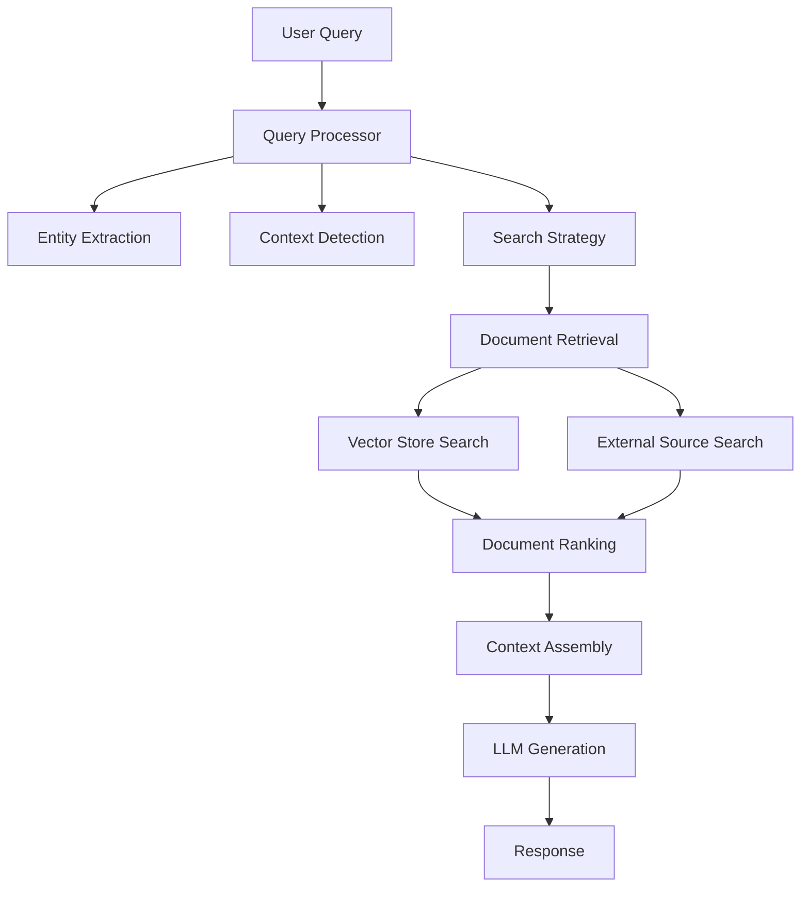

# BioRAG System Overview

## 🧬 What is BioRAG?

BioRAG (Biological Retrieval-Augmented Generation) is a comprehensive RAG system specifically designed for biological and biomedical research. It combines state-of-the-art retrieval and generation techniques with specialized biological data sources to provide intelligent, context-aware answers to biological questions.

## 🏗️ System Architecture

### Core Components

```
BioRAG/
├── biorag/                     # Main package
│   ├── __init__.py            # Package entry point
│   ├── __main__.py            # Module runner (python -m biorag)
│   ├── main.py                # CLI application
│   ├── client.py              # Main client interface
│   ├── config.py              # Configuration management
│   │
│   ├── data_sources/          # Biological database clients
│   │   ├── __init__.py
│   │   ├── base_client.py     # Base class for data sources
│   │   ├── geo_client.py      # GEO database client
│   │   ├── pubmed_client.py   # PubMed client
│   │   └── uniprot_client.py  # UniProt protein database client
│   │
│   ├── embeddings/            # Text embedding services
│   │   ├── __init__.py
│   │   ├── embedding_service.py    # General embedding service
│   │   └── bio_embeddings.py      # Biology-specific embeddings
│   │
│   ├── storage/               # Vector storage and management
│   │   ├── __init__.py
│   │   ├── chroma_store.py    # ChromaDB vector storage
│   │   └── document_store.py  # High-level document management
│   │
│   ├── retrieval/             # Intelligent retrieval engine
│   │   ├── __init__.py
│   │   ├── query_processor.py # Biological query processing
│   │   └── retriever.py       # Main retrieval coordinator
│   │
│   ├── generation/            # Language model integration
│   │   ├── __init__.py
│   │   ├── llm_client.py      # LLM client (OpenAI)
│   │   └── rag_pipeline.py    # Complete RAG pipeline
│   │
│   ├── api/                   # REST API endpoints
│   │   ├── __init__.py
│   │   ├── app.py             # FastAPI application
│   │   └── schemas.py         # Pydantic schemas
│   │
│   └── utils/                 # Utility functions
│       ├── __init__.py
│       ├── text_processing.py # Text processing utilities
│       └── data_validators.py # Data validation
│
├── examples/                  # Usage examples
│   ├── basic_usage.py        # Basic client usage
│   └── api_usage.py          # API usage examples
│
├── requirements.txt          # Python dependencies
└── README.md                # Project documentation
```

## 🔧 Key Features

### 1. Multi-Source Data Retrieval

- **GEO (Gene Expression Omnibus)**: Gene expression datasets
- **PubMed**: Scientific literature and research papers
- **UniProt**: Protein sequences and functional information
- Extensible architecture for additional biological databases

### 2. Intelligent Query Processing

- **Entity Extraction**: Automatically identifies genes, proteins, diseases, organisms
- **Context Detection**: Determines biological context (gene, disease, pathway, etc.)
- **Smart Routing**: Uses different strategies based on query type
- **Query Enhancement**: Expands queries with biological synonyms and context

### 3. Specialized Biological Embeddings

- **Domain-Specific Preprocessing**: Handles biological terminology and abbreviations
- **Metadata Integration**: Includes organism, gene, and pathway information in embeddings
- **Context-Aware Search**: Searches with biological context understanding

### 4. Advanced RAG Pipeline

- **Hybrid Retrieval**: Combines semantic search with metadata filtering
- **Dynamic Source Selection**: Intelligently selects relevant data sources
- **Context-Aware Generation**: Uses biological domain knowledge in responses
- **Multiple Response Types**: Answers, summaries, research insights

### 5. REST API Interface

- **Comprehensive Endpoints**: Query, search, compare, explore pathways
- **Research Tools**: Experimental design suggestions, research recommendations
- **Document Management**: Search and retrieve stored documents
- **System Monitoring**: Health checks and statistics

## 📊 Data Flow



## 🚀 Usage Examples

### Basic Client Usage

```python
from biorag import BioRAGClient

async with BioRAGClient() as client:
    # Ask a biological question
    result = await client.query("What is the function of TP53?")
    print(result['answer'])

    # Search for gene information
    gene_info = await client.search_gene("BRCA1", organism="Homo sapiens")

    # Compare biological entities
    comparison = await client.compare_genes(["TP53", "BRCA1"])

    # Explore pathways
    pathway = await client.explore_pathway("p53 pathway")
```

### API Usage

```bash
# Start the server
python -m biorag serve

# Query via HTTP
curl -X POST "http://localhost:8000/query" \
  -H "Content-Type: application/json" \
  -d '{"question": "What causes Alzheimer disease?", "max_documents": 5}'
```

### CLI Usage

```bash
# Test a query
python -m biorag test-query "What is CRISPR?"

# Search for gene information
python -m biorag search-gene APOE --organism "Homo sapiens"

# Get system info
python -m biorag info

# Show statistics
python -m biorag stats
```

## ⚙️ Configuration

The system uses environment variables for configuration:

```bash
# Required
OPENAI_API_KEY=your_openai_api_key

# Optional
NCBI_API_KEY=your_ncbi_api_key
CHROMA_PERSIST_DIRECTORY=./chroma_db
EMBEDDING_MODEL=all-MiniLM-L6-v2
OPENAI_MODEL=gpt-3.5-turbo
RATE_LIMIT_PER_SECOND=3
```

## 🧠 Intelligent Features

### Query Understanding

- Recognizes biological entities (genes, proteins, diseases)
- Understands research context and intent
- Routes queries to appropriate data sources
- Expands abbreviations and technical terms

### Contextual Responses

- Provides biologically accurate information
- Cites source databases
- Explains experimental methods and significance
- Suggests follow-up research questions

### Research Support

- Experimental design recommendations
- Literature analysis and synthesis
- Pathway exploration and visualization
- Comparative analysis of biological entities

## 📈 Performance & Scalability

### Vector Storage

- **ChromaDB**: Efficient similarity search
- **Persistent Storage**: Data persists between sessions
- **Metadata Filtering**: Fast filtering by source, organism, etc.
- **Incremental Updates**: Add new documents without rebuilding

### Rate Limiting

- **Respectful API Usage**: Built-in rate limiting for external APIs
- **Concurrent Processing**: Parallel searches across data sources
- **Caching**: Reduces redundant API calls

### Monitoring

- **Health Checks**: System status monitoring
- **Usage Statistics**: Track document counts and sources
- **Error Handling**: Graceful degradation and error reporting

## 🔮 Future Enhancements

### Additional Data Sources

- **STRING**: Protein-protein interactions
- **KEGG**: Pathway databases
- **ChEMBL**: Chemical and drug data
- **Reactome**: Biological pathways
- **GO**: Gene Ontology

### Advanced Features

- **Multi-modal Support**: Handle images, structures, sequences
- **Real-time Updates**: Live data source synchronization
- **Custom Models**: Domain-specific language models
- **Workflow Integration**: Connect with research tools

### User Interface

- **Web Dashboard**: Interactive query interface
- **Visualization**: Pathway and network visualizations
- **Collaboration**: Share queries and results
- **Export Options**: Multiple output formats

## 🎯 Use Cases

### Research Scientists

- Literature review and analysis
- Hypothesis generation
- Experimental planning
- Cross-database information synthesis

### Bioinformaticians

- Data interpretation assistance
- Pipeline documentation
- Method selection guidance
- Result validation

### Students & Educators

- Learning biological concepts
- Research methodology training
- Literature exploration
- Concept explanation

### Pharmaceutical Research

- Drug target identification
- Mechanism of action studies
- Safety profile analysis
- Competitive intelligence

---

## 🚀 Getting Started

1. **Install Dependencies**

   ```bash
   pip install -r requirements.txt
   ```

2. **Set Environment Variables**

   ```bash
   export OPENAI_API_KEY="your_api_key_here"
   ```

3. **Run the System**

   ```bash
   # CLI mode
   python -m biorag test-query "What is apoptosis?"

   # API mode
   python -m biorag serve
   ```

4. **Explore Examples**
   ```bash
   python examples/basic_usage.py
   python examples/api_usage.py
   ```

The BioRAG system represents a significant advancement in biological information retrieval and analysis, providing researchers with intelligent, context-aware assistance for their scientific inquiries.
